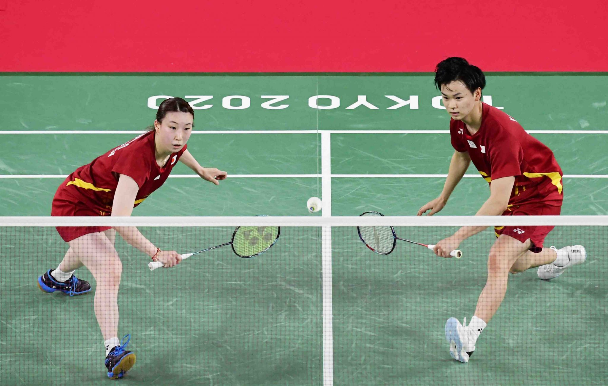

# Homework 1: 
**Name:** Aamr Ibrahim  
**HW Number:** HW1  
**Class:** CS 625 - Data Visualization  
**Due Date:** January 26, 2025  

---

 

### 1. What is the URL of the GitHub repo that you created in your personal account?  
[[Click on my repo](https://github.com/EvilDuck300/CS625_HW1.git)]  

### 2. What is pull vs clone in GitHub?  
- **Pull:** The `git pull` command is used to fetch and merge changes from a remote repository into your local repository. It updates your local branch with the latest changes from the remote branch.
- **Clone:** The `git clone` command is used to create a local copy of a remote repository. This is typically the first step to start working on a project hosted on GitHub.  

### 3. You have committed a change on your local machine/remote. However, you want to undo the changes committed. How would you do that?  
To undo a commit, use the commit command as shown below:  

-   
  ```bash
  git reset --soft HEAD~1

### 4. My Favorite Olympic Sport

  ****


### 4. Paris Olympics 2024 results


 **This is the result of at least : **


### 5. Google colab

 **This is my Google colab:  [Click on my python notebook](https://colab.research.google.com/drive/1FJSsweAXFndjtxPLKmt1PizYOW8Qx46F?usp=sharing)**

### 5. Plotlib/Seaborn results and explanation

****


 **This is a scatterplot of the relationship between the bill length (x-axis) and bill depth  (y-axis) for penguins in the dataset. Each dot is a single penguin showing the  variation in bill dimensions across individual samples. This visualization is helpful to identify trends or clusters based on bill  dimensions.**

 ****
 
**This bar chart provides information about the average body mass (y-axis) of penguins by their  species (x-axis) with the data further divided by sex (color-coded). The use of  Dodge() is used to separate the bars for male and female penguins within each species, which makes it  easier to compare genders within a species.**

### 6. Observable and Vega-Lite

With the scatter plot, if you change the function from markCircle() to markSquare()

vl.markSquare()                        // Make a scatter chart
  .data(cars)                          // Using the cars data (below)
  .encode(
    vl.x().fieldQ("Horsepower"),       // For x, use the Horsepower field
    vl.y().fieldQ("Miles_per_Gallon"), // For y, use the Miles_per_Gallon field
    vl.tooltip().fieldN("Name")        // For tooltips, show the Name field
  )
  .render()                           // Draw the chart

  The scatterplot changes from circular markers to square markers:
  


__________________________________________________________________________________

With the scatter plot, if you change the function from markCircle() to markPoint()

vl.markPoint()                        // Make a scatter chart
  .data(cars)                          // Using the cars data (below)
  .encode(
    vl.x().fieldQ("Horsepower"),       // For x, use the Horsepower field
    vl.y().fieldQ("Miles_per_Gallon"), // For y, use the Miles_per_Gallon field
    vl.tooltip().fieldN("Name")        // For tooltips, show the Name field
  )
  .render()                            // Draw the chart

  The scatterplot uses default point markers:

  

  __________________________________________________________________________________

  vl.markCircle()                        // Make a scatter chart
  .data(cars)                          // Using the cars data (below)
  .encode(
    vl.x().fieldQ("Miles_per_Gallon"),       // For x, use the Horsepower field
    vl.y().fieldQ("Horsepower"), // For y, use the Miles_per_Gallon field
    vl.tooltip().fieldN("Name")        // For tooltips, show the Name field
  )
  .render()                            // Draw the chart

  This is the result:
  
  The data is flipped: "Miles_per_Gallon" becomes the x-axis, and "Horsepower" becomes the y-axis.

  ______________________________________________________________________________

  vl.markBar()                          // Make a bar chart
  .data(cars)                         // Using the cars data (below)
  .encode(
    vl.x().fieldN("Origin"),          // For x, use the Origin field as nominal (categorical)
    vl.y().fieldQ("Miles_per_Gallon"), // For y, use the Miles_per_Gallon field
    vl.tooltip().fieldN("Name")       // For tooltips, show the Name field
  )
  .render()                           // Draw the chart
This is the result:


___________________________________________________________________________________

vl.markBar()                          // Make a bar chart
  .data(cars)                         // Using the cars data (below)
  .encode(
            // For x, use the Origin field as nominal (categorical)
    vl.x().fieldQ("Miles_per_Gallon"), // For y, use the Miles_per_Gallon field
    vl.tooltip().fieldN("Name")       // For tooltips, show the Name field
  )
  .render()                           // Draw the chart

  This is the result:
  vl.markBar()                          // Make a bar chart
  .data(cars)                         // Using the cars data (below)
  .encode(
            // For x, use the Origin field as nominal (categorical)
    vl.x().fieldQ("Miles_per_Gallon"), // For y, use the Miles_per_Gallon field
    vl.tooltip().fieldN("Name")       // For tooltips, show the Name field
  )
  .render()                           // Draw the chart

  
  The chart collapses into a single bar that sums up all "Miles_per_Gallon" values.

 **When the line vl.y().fieldN("Origin") was removed from the resulting chart there is  only one horizontal bar because it eliminated the grouping of data by the Origin field. Without this categorical  grouping, VegaLite aggregates the dataset and treats Miles_per_Gallon as a single quantitative value. This means  that the chart shows the sum (or aggregate value) of all Miles_per_Gallon values across the  dataset as the length of the bar along the x-axis. This change occurs because when no categorical field  is specified for grouping, VegaLite defaults to aggregation and the y-axis becomes undefined.**


  


