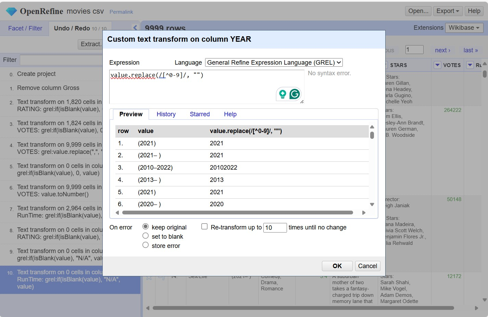
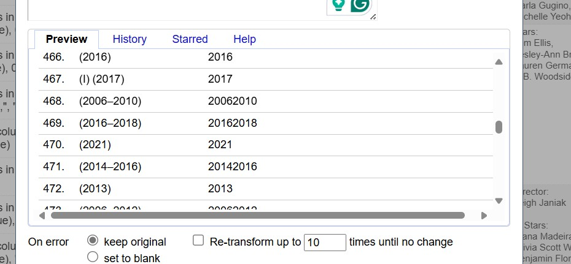

# Homework 2: 
**Name:** Aamr Ibrahim  
**HW Number:** HW2  
**Class:** CS 625 - Data Visualization  
**Due Date:** Feburary, 9 , 2025

Step 1: Remove "Gross" and Remove blank/missleading values

Step 2: Setted the "Rating" , "Votes" column cells to 0 
Rating Column:

Then set the blank values with N/A:

For the Votes i have replaced the commas from numbers using this GREL command:
value.replace(",", "")

Now i will be setting the Vote column cells to 0 

Edit Cells -> Common Transforms -> To number

Then also for RunTime Columns:

And it already tranformed as a number

Step 3: Remove any roman numerical number or string-only number

