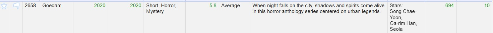

# Homework 2: 
**Name:** Aamr Ibrahim  
**HW Number:** HW2  
**Class:** CS 625 - Data Visualization  
**Due Date:** Feburary, 9 , 2025

 In the first part of the project, I checked the data in the CSV format in order to  clean and analyze it using OpenRefine. The columns were separated by commas (CSV format) and  I used quotation marks to envelope cells that contain separators in order to verify the data accuracy. Furthermore,  I allowed the options to trim leading and trailing whitespace from strings only for consistency and backslash escaped any  irregular formatting of the dataset. I set the encoding of the characters to UTF-8 to enable compatibility  with various characters. The header of the first row of the file was parsed as column headers, thus  facilitating easy identification and manipulation of the data. These settings made sure that the dataset was in the right  form and was ready for further analysis. The project was then saved with the name "movies csv"  and tagged as "HW2_EXAMPLE" so that it could be easily located and sorted. 

### Part 2:

## Step 1: Remove "Gross" and Remove blank/missleading values

Blank:

So we see blank in RunTime colums

to remove blank:

We do it again with Rating columns 

And so you can see there is no blank values:

Also with Genre:

Column Gross Remove:

## Step 2: Setted the "Rating" , "Votes" column cells to 0 
Rating Column:

Then set the blank values with N/A:

For the Votes i have replaced the commas from numbers using this GREL command:
value.replace(",", "")

__________________________________________________________

Now i will be setting the Vote column cells to 0 

Edit Cells -> Common Transforms -> To number

Then also for RunTime Columns:

And it already tranformed as a number

## Step 3: Clean the "Year" column

# To clean the values in the dataset these are the commands:

This is the result:
Part 1:

Part 2:

I created a column called startYear

And it converted to a Numeric Expression for startYear column:

I created a column called endYear

Here is the exaplanation for the code:
 m =  re.match(r'(\d{4})[-–]?(\d{4})?', value):  This line uses the re.match() function to look for some pattern at the beginning  of the string value. The regular expression  r'(\d{4})[-–]?(\d{4})?' is used to recognize something that looks like a year.   (\d{4}) it matches the exact 4 digits, this is usually the year.  [-–]? It  matches either a hyphen (-) or an en-dash (–) if there is one between  the two groups of digits. The? makes this part of the regex optional.   (\d{4})? It matches a second set of 4 digits, this is also optional.  return  int(m.group(2)) if m and m.group(2) else  int(m.group(1)) if m else None:  This line uses a conditional expression to return the right value depending on  the result of the regex match.  If the match is successful (m), it checks to see  if the second captured group (m.group(2)) is there (that is, if the second  set of digits is present). If it does, it returns that value as an integer.  If  the second group doesn’t exist but the match is successful (m), it returns the first captured group  (m.group(1)) as an integer.  If there is no match (m is  None), the function returns None.

And it converted to a Numeric Expression for endYear column:

## Step 4:  Create the "Verdict" Column

Command: 
if(value == 0, "Not known",
if(value <= 4.5, "Flop",
if(value <= 6.5, "Average",
if(value <= 8.0, "Hit",
"Super Hit"))))

Analytic Questions:

Q1: In 2021, 109 movies were listed as "Super Hit"

Q2: In 2020, Dark has the highest rating and the genre for that is Crime, Drama and Mystery

Q3: The top 3 generes are:
Animation, Action and Crime with the lowest votes in the dataset

Q4: Movie Name: Goedam , Number of votes: 694 and Short, Horror, Mystery

Q5: 
The top 5 movies wiih highest vote and Verdict with Flop are:

1. The Human Centipede (First Sequence)
2. 365 Dni
3. Thunder Force  
4. Troy: Fall of a City
5. Force Of Nature

