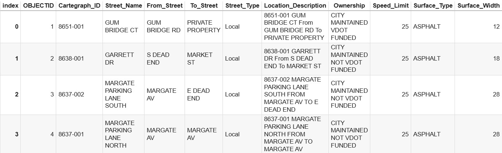
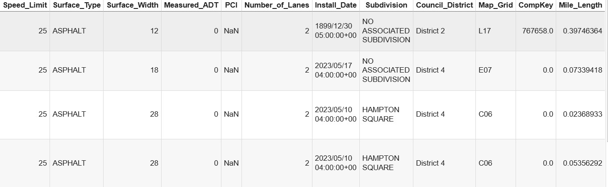
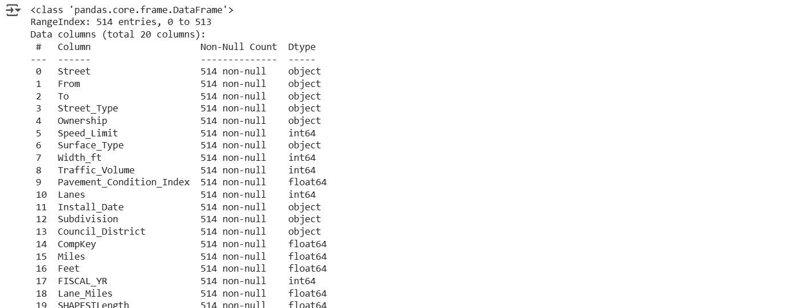
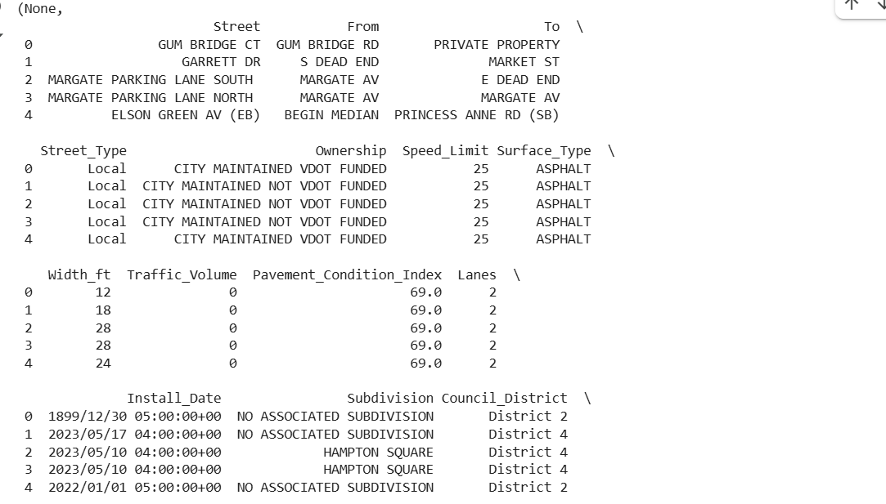
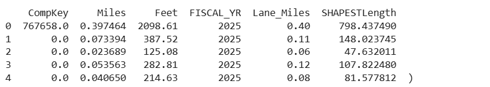
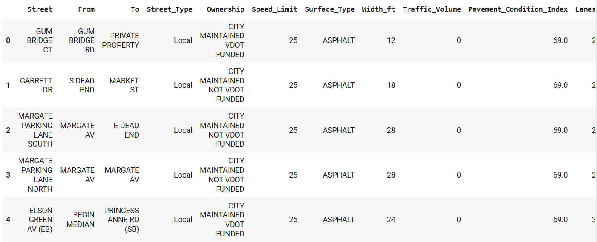
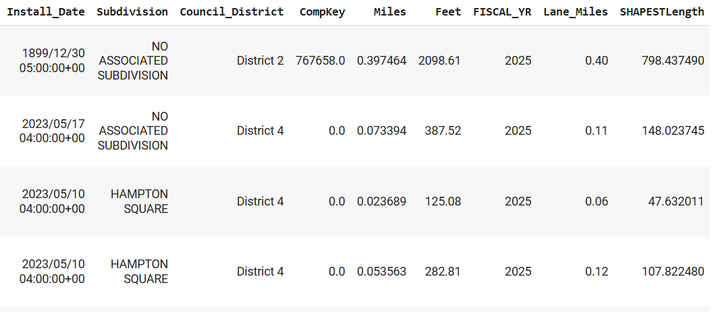
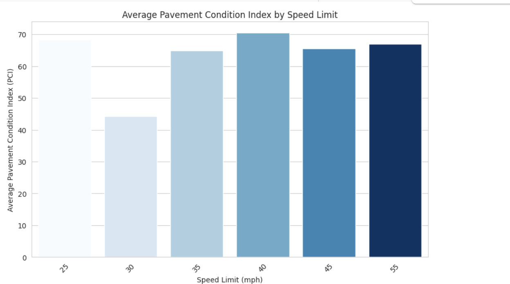

# Homework 3: 
**Name:** Aamr Ibrahim  
**HW Number:** HW3  
**Class:** CS 625 - Data Visualization  
**Due Date:** Feburary 23, 2025

# 1. DATA 
This is the dataset that i chose from the VA beach page:
[VA BEACH DATASET](https://data.virginiabeach.gov/datasets/c13e8bc5c93441c186464a87bec0c907_0/explore)

Name: Pavement_Segments

Dataset name: PW_Pavement_Segments.csv

Justification: 
 Provides pavement segment level data which includes information on road names, surface types, lane miles and PCI  (Pavement Condition Index).

Num of rows: 514 rows 

Num of columns: 26

## Data Prerocessing

file_head = '/content/PW_Pavement_Segments.csv'
df = pd.read_csv(file_head)
df.head(4)
## Remove unnecessary columns
columns_to_drop = ["OBJECTID", "Cartegraph_ID", "Location_Description", "Map_Grid", "created_date", "last_edited_date"]
df_cleaned = df.drop(columns=columns_to_drop)

## Rename columns for better readability
df_cleaned = df_cleaned.rename(columns={
    "Street_Name": "Street",
    "From_Street": "From",
    "To_Street": "To",
    "Surface_Width": "Width_ft",
    "Measured_ADT": "Traffic_Volume",
    "PCI": "Pavement_Condition_Index",
    "Number_of_Lanes": "Lanes",
    "Mile_Length": "Miles",
    "Foot_Length": "Feet",
    "LANE_MI": "Lane_Miles"
})

## Handle missing values: Fill missing PCI values with the median PCI
df_cleaned["Pavement_Condition_Index"] = df_cleaned["Pavement_Condition_Index"].fillna(df_cleaned["Pavement_Condition_Index"].median())
df_cleaned["CompKey"] = df_cleaned["CompKey"].fillna(0)

## Display updated dataset information
df_cleaned.info(), df_cleaned.head()

Output:

This is the cleaned dataset:

## Creating the Charts

Bar Chart:

