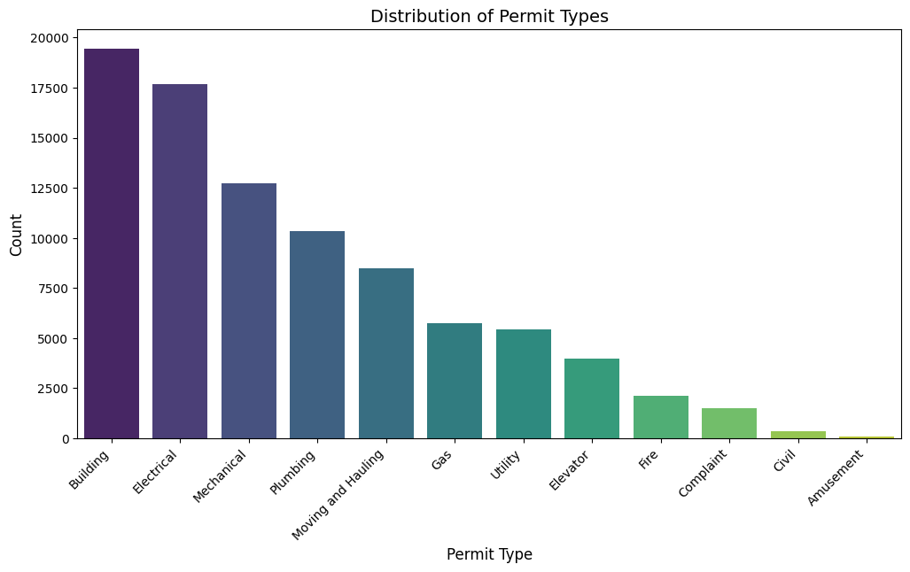
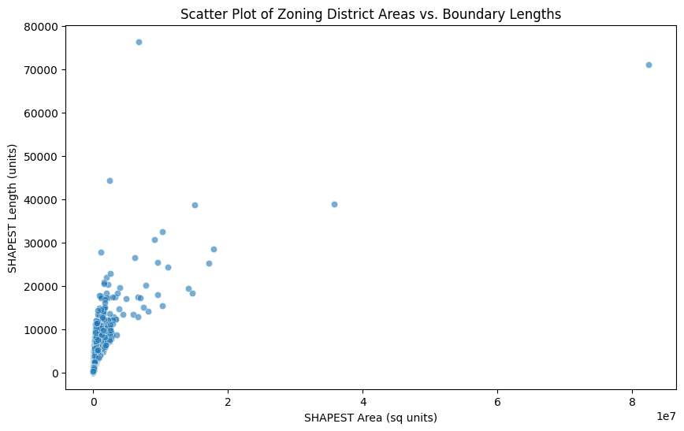
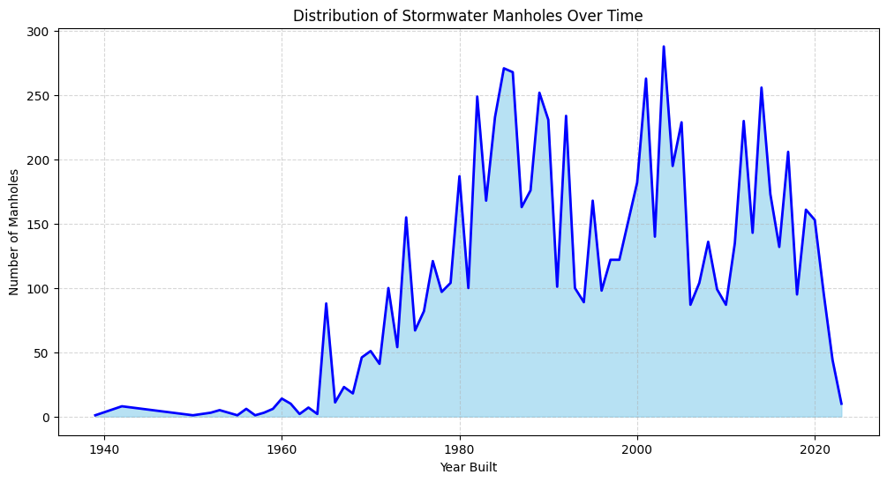
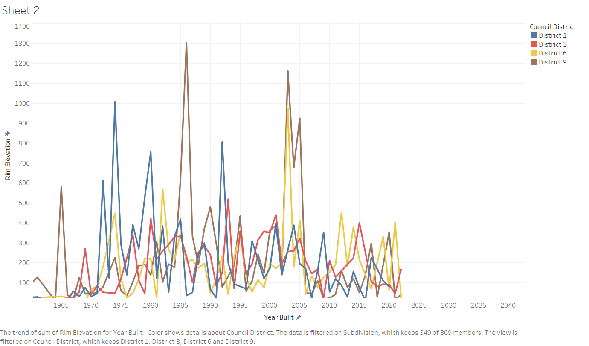

# Homework 3: 
**Name:** Aamr Ibrahim  
**HW Number:** HW3  
**Class:** CS 625 - Data Visualization  
**Due Date:** Feburary 23, 2025

# 1. DATA 
This is the dataset that i chose from the VA beach page:
[VA BEACH DATASET FIRST DATASET](https://data.virginiabeach.gov/datasets/15292e05ab3a42d5984e6033b2f6a6d4_0/explore)

[VA BEACH DATASET SECOND DATASET](https://data.virginiabeach.gov/datasets/a7b2f685f9ee4865befe1f6502c0047d_37/explore?location=36.740530%2C-76.047850%2C10.61)

[VA BEACH DATASET THIRD DATASET](https://data.virginiabeach.gov/datasets/bf1337ce881646b8977fe26bd44ca1df_4/explore?location=36.760783%2C-76.074600%2C10.86)

# Names:

Building Permits Applications

Zoning District

Stormwater Manhole

## Data Prerocessing
To prepare the data for visualization, the following steps were performed:

Data Cleaning: Removed missing values and inconsistencies.

Filtering: Selected relevant subsets of the data to enhance readability.

Aggregation: Grouped data by meaningful categories to highlight trends.

Normalization: Standardized numerical values where necessary to ensure comparability.

# Visualization Idioms & Visual Encoding Choices
## Bar Chart (First Dataset)

Idiom: Bar Chart / Mark: Rectangle
| Data: Attribute | Data: Attribute Type  | Encode: Channel | 
| --- |---| --- |
| Category | Categorical | Vertical spatial region (y-axis) |
| Value | Quantitative | Horizontal position on a common scale (x-axis) |

## Scatterplot (Second Dataset)

Idiom: Scatterplot / Mark: Point
| Data: Attribute | Data: Attribute Type  | Encode: Channel | 
| --- |---| --- |
| X Variable | Quantitative | Horizontal spatial region (x-axis) |
| Y Variable | Quantitative | Horizontal position on a common Vertical spatial region (y-axis) |
| Category    | Categorical  | Color

## Area Chart (Third Dataset)

Idiom: Area Chart  / Mark: Area
| Data: Attribute | Data: Attribute Type  | Encode: Channel | 
| --- |---| --- |
| X Variable | Quantitative | Horizontal spatial region (x-axis) |
| Y Variable | Quantitative | Horizontal position on a common Vertical spatial region (y-axis) |
| Category    | Categorical  | Color

## Multiple Line Chart (Fourth Dataset)

Idiom: Area Chart  / Mark: Area
| Data: Attribute | Data: Attribute Type  | Encode: Channel | 
| --- |---| --- |
| X Variable | Quantitative | Horizontal spatial region (x-axis) |
| Y Variable | Quantitative | Horizontal position on a common Vertical spatial region (y-axis) |
| Category    | Categorical  | Line Color

# Creating Charts

### First Chart: 
  ****

  ### Second Chart: 
  ****

### Third Chart: 
  ****

### Fourth Chart (Using Tableau): 
  ****

# Customizations

Adjusted axis scales for better readability.

Used distinct colors to differentiate categories.

Added gridlines and labels for clarity.

Modified line thickness for better distinction.

# Reflection

For the chart recreated in another tool, the ease of use and customization capabilities were assessed. 

# References

List any external resources consulted for data processing, visualization techniques, or tool documentation.

[Reference 1]

[Reference 2]

[Reference 3]

## Links to Code / Workbooks

[Colab code for both cleaning and visulation](https://data.virginiabeach.gov/datasets/bf1337ce881646b8977fe26bd44ca1df_4/explore?location=36.760783%2C-76.074600%2C10.86)

