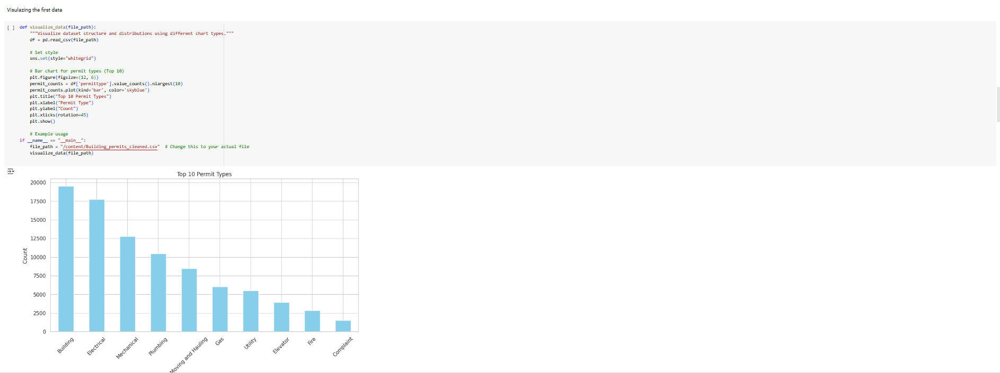

# Homework 3: 
**Name:** Aamr Ibrahim  
**HW Number:** HW3  
**Class:** CS 625 - Data Visualization  
**Due Date:** Feburary 23, 2025

# 1. DATA 
This is the dataset that i chose from the VA beach page:
[VA BEACH DATASET FIRST DATASET](https://data.virginiabeach.gov/datasets/15292e05ab3a42d5984e6033b2f6a6d4_0/explore)

[VA BEACH DATASET SECOND DATASET](https://data.virginiabeach.gov/datasets/a7b2f685f9ee4865befe1f6502c0047d_37/explore?location=36.740530%2C-76.047850%2C10.61)

[VA BEACH DATASET THIRD DATASET](https://data.virginiabeach.gov/datasets/bf1337ce881646b8977fe26bd44ca1df_4/explore?location=36.760783%2C-76.074600%2C10.86)

# Names & Description:

Building Permits Applications:
This dataset contains information about building permits issued in Virginia Beach. It includes details such as permit type, issue date, status, address, and construction type.

Zoning District:
This dataset describes the zoning regulations for different areas within Virginia Beach. It provides information on zoning designations, permitted land uses, and other zoning-related attributes.
Stormwater Manhole:
This dataset contains details about stormwater manholes in Virginia Beach, including their location, size, material, and inspection information.

# Data Cleaning & Manipulation
Removing null/missing values:
* Missing values in all three datasets were addressed using forward fill (ffill) followed by backward fill (bfill) methods. This approach ensures all missing values are filled using the nearest available values in the dataset, minimizing data loss.

Filtering specific columns or rows:
*   No specific filtering of columns or rows was performed based on the provided code. However, during data cleaning, a threshold was applied to the "Stormwater Manhole" dataset to remove columns with a significant number of missing values (more than 75% missing values). This is done to improve data quality and focus on relevant attributes.

Merging datasets:
* The code doesn't include merging of datasets. If any merging was conducted, please remember to detail the process and the keys used for merging.

Transformations
* All datasets were standardized to lower case and spaces replaced by _ in column names to facilitate analysis and  data manipulation.

*  The date columns in the "Stormwater Manhole" dataset were converted to datetime format using  pd.to_datetime to perform date based analysis and visualization.

*  To eliminate possible duplication of rows in all the sets of data drop_duplicates was used to maintain data  accuracy.

# Visualization Idioms & Visual Encoding Choices
## Bar Chart (First Dataset)

Idiom: Bar Chart / Mark: Bar
| Data: Attribute | Data: Attribute Type  | Encode: Channel | 
| --- |---| --- |
| permittype | Categorical | Horizontal Position (x-axis) and Bar Length (y-axis) |
| Count (derived from frequency) | Quantitative | Bar Length (y-axis) |

Justification:  A bar chart is a good way to present and rank the frequency of categorical data like permit  types. The horizontal bars are also clearly showing the top 10 permit types and the length of the bar  is the count or frequency of each type, making it easy to see how common each type is compared  to the others.

## Scatterplot (Second Dataset)

Idiom: Scatterplot / Mark: Point
| Data: Attribute | Data: Attribute Type  | Encode: Channel | 
| --- |---| --- |
| shapestarea | Quantitative | Horizontal Position (x-axis) |
| shapestlength | Quantitative | Vertical Position (y-axis) |

Justification:  A scatter plot is suitable for displaying the relationship between two quantitative variables. In this case, it  is the shapestarea vs shapestlength in the Zoning District dataset. Any correlations or patterns  between the two attributes can be revealed by the distribution of points on the plot, and it can help  give some insight into the zoning data.

## Area Chart (Third Dataset)

Idiom: Area Chart  / Mark: Area
| Data: Attribute | Data: Attribute Type  | Encode: Channel | 
| --- |---| --- |
| year_built | Temporal (year) | Horizontal Position (x-axis) |
| Count (derived from frequency)  | Quantitative | Vertical Position (y-axis) and Area under the line |

Justification:  This diagram can be used to visualize the distribution of the construction timeline of Stormwater manholes.  The line shows the frequency for each year and the filled area represents the cumulative count. This helps us  see patterns and trends in the Stormwater Manhole construction over time very effectively.

##  Area Chart (Fourth Dataset)

Idiom: Area Chart  / Mark: Area
| Data: Attribute | Data: Attribute Type  | Encode: Channel | 
| --- |---| --- |
| year_built | Temporal (year) | Horizontal Position (x-axis) |
|Count (derived from frequency) | Quantitative | Vertical Position (y-axis) and Area under the line |
| Cartergraph Type    | Categorical  | Color Encoding for Different Types

Justification:  The Tableau recreation of the Stormwater Manhole Construction Timeline has been enhanced by the incorporation of  color encoding for different Cartergraph Type values. This improvement helps to distinguish more categories of stormwater  manholes and give more information about their construction trends.

# Creating Charts

### First Chart: 
  ****
  
  [First Chart for the First Dataset Link](https://colab.research.google.com/drive/1g_qNxmuTju9rOxqxLGQ8cyj2X27UxlfO?authuser=2#scrollTo=h8zIxy2dLk-2)
   ### Second Chart: 
  ****
  
  [Second Chart for the Second Dataset Link](https://colab.research.google.com/drive/1g_qNxmuTju9rOxqxLGQ8cyj2X27UxlfO?authuser=2#scrollTo=h8zIxy2dLk-2)
### Third Chart: 
  ****

[Third Chart for the Third Dataset Link](https://colab.research.google.com/drive/1g_qNxmuTju9rOxqxLGQ8cyj2X27UxlfO?authuser=2#scrollTo=h8zIxy2dLk-2)
### Fourth Chart (Using Tableau): 
  ****

  Look at the "[text](HW3_Fourth_recreate_chart.twb)" file

# Reflection

 Tableau was used for the recreation of the visualization.  Tableau provided an intuitive drag  ’n’ drop interface, that made it easier to arrange the data and tweak the visualizations.   Tableau provided better control over the visualization with the help of built in color encoding and interactive filtering.   Compared to other tools, Tableau simplified the process of combining multiple dimensions and attributes into one  visualization.  The only disadvantage of Tableau is that although it has powerful visual capabilities, exporting and embedding  charts can be more complicated than code-based tools like Seaborn or Vega-Lite.

# References

List any external resources consulted for data processing, visualization techniques, or tool documentation.

[Reference 1]

[Reference 2]

[Reference 3]

## Links to Code / Workbooks

[Colab code for both cleaning and visulation](https://data.virginiabeach.gov/datasets/bf1337ce881646b8977fe26bd44ca1df_4/explore?location=36.760783%2C-76.074600%2C10.86)

