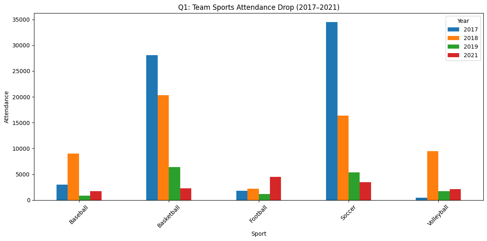

# Project Report

**Name:** Aamr Ibrahim  

**Class:** CS 625 - Data Visualization  
**Due Date:** April 21 , 2025

# Selected DataSet: Summer Sports Experience(2017 - 2021)

# Link to this Dataset

Dataset link: [NYC Open Data – Summer Sports Experience (2017–2021)](https://data.cityofnewyork.us/Recreation/Summer-Sports-Experience/4p8d-4p2z)

Topic:
The selected topic is  Weekly Sports Attendance Patterns, which is aimed at determining the patterns in  sports participation during various days of the week. The dataset “Summer Sports Experience  (2017-2021)” that contains the records of borough locations, park names, types of sports played, and daily  attendance figures can be used to analyze the attendance during different days of the week. From the data,  it can be confirmed that some days are more active than others in attendance, if weekends are better than  weekdays, and which types of sports are more popular on specific days. Furthermore, we can find out  how the attendance patterns have changed over the years from 2017 to 2021 and evaluate the  possible effects of external factors such as the COVID-19 pandemic. This analysis will offer insights into sports  participation behavior, which can help in identifying trends that may be useful for sports organizers, community planners,  and policymakers.

# Why choosing the dataset?

* The dataset includes extensive weekly attendance information for multiple sports throughout different NYC boroughs.

* The dataset tracks participation patterns across three time points: before the pandemic, during the pandemic, and  after the pandemic which makes it suitable for analyzing temporal trends.

* The dataset tracks participation patterns
across three time points: before the pandemic, during the pandemic, and  after the pandemic which makes it suitable for analyzing temporal trends.

* It enables behavior-based insights (e.g., did people switch to outdoor or individual sports  post-COVID?).

# Purpose and Goal of this Analysis

* The purpose of this study is to determine the impact of COVID-19 on the participation of team  and individual sports.

* The research aims to determine which sports recovered or expanded after the pandemic so stakeholders can direct their resources  toward the most promising activities.

* The goal is to create visualizations which explain public participation changes in NYC parks while making data insights  useful for action.

* Explain to stakeholders (e.g., NYC Parks Department, public health leaders, recreation planners)  how sport participation changed during a critical public health event.

* Develop visualizations which both present important patterns and support resource allocation and program design.

# 3. Research Questions

* Q1: Which team sports with high attendance rates saw the steepest decline in participation following the COVID-19 pandemic, and how might the nature of these sports contribute to this decrease?

* Q2: Which sports became increasingly popular in the wake of the Covid-19 pandemic, and do they share characteristics such as being outdoor activities, individual-focused, or conducive to social distancing?

# 4. Data Visualization and Analysis

## 4.1: Q1: Decline in Team Sports Attendance Post-COVID

* I have developed an interactive multi-line plot with Plotly to display attendance trends for popular team sports  (Basketball, Soccer, Football, Baseball, Volleyball) from 2017 to 2021.

Interactive Visualization for Q1:

[Go to "Q1: Visulization" header to find the first chart](https://colab.research.google.com/drive/1zWXzO3s0jVFLVDSdRx4p6S061SugWRuV?usp=sharing)

Idiom: Line Chart / Mark: Line

| Data: Attribute | Data: Attribute Type  | Encode: Channel |
| --- |---| --- |
| Year | Key, Ordered (Temporal) | Horizontal position (x-axis) |
| Average Weekly Attendance | Value, Quantitative | Vertical position (y-axis) |
| Sports Type | Key, Categorical | Color hue |
| Data Points | Value, Quantitative | Point marks at data values |
| Sport Categories | Key, Categorical | Legend |

Explanation:

 The Q1 question was addressed by developing an interactive multi-line plot with Plotly to display attendance  patterns for Basketball, Soccer, Football, Baseball, and Volleyball from 2017 to  2021.  The combination of lines and points (markers) helps viewers see both the overall trends and specific values  at each time point. Color encoding for different sports makes it easy to track individual sports across the timeline while maintaining clear visual separation.  The interactive nature of the plot (using Plotly) allows users to hover over points for exact  values and toggle specific sports on/off for focused analysis.This visualization is particularly effective for showing the impact of COVID-19 on team sports attendance, as it clearly displays pre-pandemic (2017-2019), pandemic (2020), and post-pandemic (2021) periods.

## 4.2: Q2: Sports That Gained Popularity Post-COVID

  The second question required us to create a line chart showing the top 5 sports with rising average  attendance between 2017 and 2021. The Plotly tool enabled us to create this visualization  which includes interactive features for deeper examination.

  

  

  

  

  Interactive Visualization for Q2:
  

  [Go to "Q2: Visulization" header to find the second chart](https://colab.research.google.com/drive/1zWXzO3s0jVFLVDSdRx4p6S061SugWRuV?usp=sharing)

  Idiom: Line Chart / Mark: Line

  | Data: Attribute | Data: Attribute Type  | Encode: Channel |
  | --- |---| --- |
  | Year | Key, Ordered (Temporal) | Horizontal position (x-axis) |
  | Average Weekly Attendance | Value, Quantitative | Vertical position (y-axis) |
  | Sports Type | Key, Categorical | Color hue |
  | Data Points | Value, Quantitative | Point marks at data values |
  | Sport Categories | Key, Categorical | Legend |

  Explanation:
   A multi-line chart was chosen to track and compare the attendance patterns of sports that gained popularity  post-COVID.The visualization effectively shows which sports experienced growth by displaying their trajectories from pre-pandemic  to post-pandemic periods. Points at each year allow precise reading of values while connecting lines reveal  trends and growth patterns.Color coding differentiates between sports categories, making it easy to follow individual  sports performance over time. The interactive features enable detailed exploration of specific sports and time periods, allowing viewers  to identify exactly when certain sports began showing increased popularity. This design is particularly suitable for identifying sports that  became more popular during and after the pandemic, helping to answer questions about changes in recreational preferences during  COVID-19.

# 5. Final Thoughts:
 The development of these visualizations took approximately 2 days. The most time-consuming aspects involved  data cleaning and transformation, as well as experimenting with different plot types and libraries to find the most effective  representations.

 

